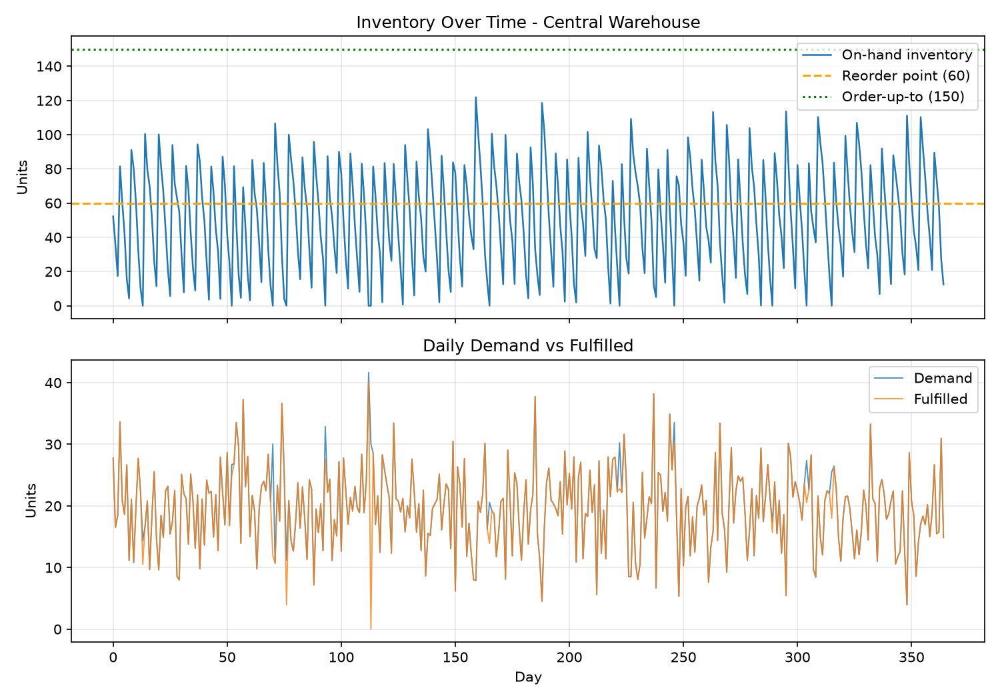

# Supply Chain Digital Twin — Phase 1: Simulation Core

A day-stepped simulation of a warehouse facing stochastic demand, replenished under an (s, S) reorder policy from an unconstrained supplier. Reports service level, fill rate, stockout, and cost KPIs — for a single run and across a 30-seed replication study.



## Run it

```bash
pip install -r requirements.txt
python -m supply_chain_twin.run
```

Output:

```
================================================
  SUPPLY CHAIN TWIN - Phase 1 (single run)
================================================
Service level             96.4%
Fill rate                 98.6%
Stockout days                13
Average inventory          51.2
Holding cost            9341.28
Ordering cost           5250.00
Total cost             14591.28

================================================
  Replication study (30 seeds)
================================================
KPI                       mean       std   (n=30)
Service level            95.3%      1.0%
Fill rate                98.4%      0.4%
Stockout days             17.0       3.6
Average inventory         51.0       1.1
Holding cost              9316       203
Ordering cost             5352       119
Total cost               14669       322
```

A single simulation run is one draw from a random process — the replication study reruns the identical scenario across 30 independent demand streams so every KPI comes with a variability estimate, not just a point value.

## Structure

```
supply_chain_twin/
├── entities.py   # Node, Inventory, Shipment — the physical/data model
├── policies.py   # ReorderPolicy protocol + (s, S) implementation
├── engine.py     # SimulationEngine, KPIs, replication runner
└── run.py        # Baseline scenario: KPI report + chart
tests/
└── test_simulation.py
```

## How it works

Each simulated day: pending shipments whose lead time has elapsed are received; stochastic demand is drawn and fulfilled from on-hand stock; the reorder policy is evaluated against inventory position (on-hand + on-order, which prevents duplicate orders while a shipment is in transit) and a replenishment order is placed if triggered; holding and ordering costs are accrued; the day's on-hand level is snapshotted.

Modeling assumptions, chosen deliberately for Phase 1:

- **Single echelon** — one warehouse, one unconstrained supplier.
- **Lost sales** — unmet demand is lost, not backordered.
- **Overdispersed demand** — Poisson baseline plus Gaussian noise, floored at zero; real demand is usually noisier than a pure Poisson process.
- **Lead time convention** — an order placed on day *t* with lead time *L* arrives at the start of day *t + L*.

## Tests

```bash
python -m pytest tests/
```

Twelve deterministic tests cover the reorder policy math, lead-time arrival timing, duplicate-order prevention via inventory position, seed reproducibility, and the replication aggregator.

## Roadmap

This is Phase 1 of a larger digital twin project, deliberately scoped as a complete, standalone piece:

- **Phase 2** — replace the static demand assumption with a trained forecasting model (the `ReorderPolicy` protocol is the seam where a forecast-driven policy plugs in).
- **Phase 3** — a routing optimizer whose plan feeds back into the twin's state, closing the loop between forecast, simulation, and network decisions.
- **Phase 4** (optional) — an interactive Streamlit control panel over the twin's current state and forecasts.
