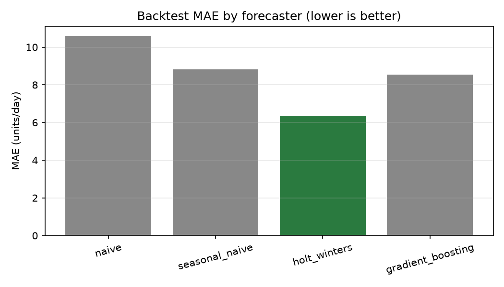
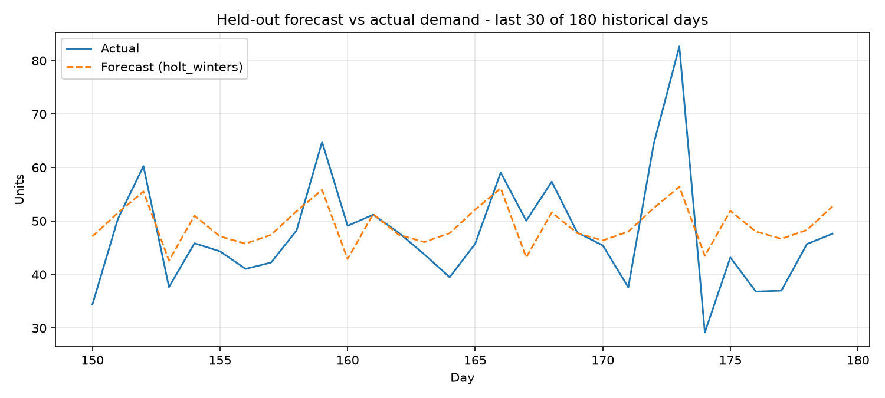
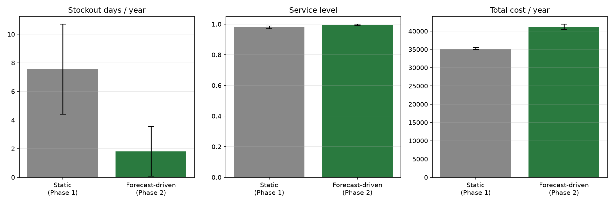

# Supply Chain Digital Twin

A supply chain simulation that started as a static inventory model (Phase 1) and now runs on real demand forecasts (Phase 2) — built incrementally, each phase a complete, working piece on its own.

## Phase 2 — Forecast-driven inventory policy

Phase 1's demand was stationary noise: no pattern, so nothing was gained by forecasting it — the sample mean was already the best possible forecast. Phase 2 replaces that with a seasonal, trending demand process, then answers the actual question: **does forecasting beat a policy tuned on historical averages?**

### How it works

```bash
python -m supply_chain_twin.run_phase2
```

1. **Generate 180 days of pre-twin history** from `SeasonalDemandProcess` — a weekly pattern (weekend peak, midweek dip) plus a mild upward trend plus noise.
2. **Backtest four forecasters** with 6-fold walk-forward validation (train up to a point, forecast 7 days ahead, slide forward, repeat):

   | model | MAE | RMSE | MAPE | resid std |
   |---|---|---|---|---|
   | naive | 10.59 | 13.66 | 25.1% | 12.20 |
   | seasonal_naive | 8.83 | 11.37 | 19.8% | 11.36 |
   | **holt_winters** | **6.35** | **8.53** | **13.7%** | **8.44** |
   | gradient_boosting | 8.55 | 11.43 | 18.8% | 11.34 |

   Holt-Winters wins — unsurprising given the data is generated from a trend + weekly seasonality process, which is exactly the shape Holt-Winters models directly. Gradient boosting still clearly beats the naive baseline, just not the classical method built for this exact pattern.

   
   

3. **Build a `ForecastDrivenPolicy`** from the winning model: every 7 days it re-forecasts demand over the lead time, sets the reorder point to *forecasted lead-time demand + safety stock* (safety stock = z-score × the forecaster's own backtested error × √lead time), and sets the order-up-to level to cover a further cycle of forecasted demand.
4. **Run both policies — forecast-driven and a static Phase-1-style baseline sized from the same historical averages — on the identical seasonal demand process**, 20 replications, 365 days:

   

   | | Static (Phase 1) | Forecast-driven (Phase 2) |
   |---|---|---|
   | Service level | 97.9% | 99.5% |
   | Stockout days/year | 7.5 | 1.8 |
   | Total cost/year | 35,209 | 41,162 (+16.9%) |

### The honest result

This is **not** "AI wins on every metric" — it's a real tradeoff, and the reason for it is the interesting part. The demand process has an upward trend. The static policy sizes its reorder point once from the first 180 days of history and never updates it, so as real demand grows past that stale average, it increasingly under-stocks — hence 4x more stockout days. The forecast-driven policy re-forecasts every 7 days and tracks the trend, correctly holding more inventory to match *actual current* demand rather than a fixed historical mean. That extra inventory costs 16.9% more in holding cost, in exchange for cutting stockouts by 76%.

Whether that trade is worth it is a real operations decision (stockout costs are usually far higher than holding costs in practice, which would flip this comparison in forecasting's favor — but this simulation only tracks holding and ordering cost, not lost-sale cost, so it can't make that call for you). That framing — the model works, and here's precisely what it trades — is worth more in an interview than an inflated "AI reduces cost 20%" headline would be.

### Architecture

```
supply_chain_twin/
├── entities.py     # Node, Inventory, Shipment
├── demand.py        # DemandProcess: StationaryPoisson (Phase 1) / Seasonal (Phase 2)
├── forecasting.py   # Forecaster implementations + walk-forward backtest
├── policies.py      # ReorderPolicy: static (s,S) and ForecastDrivenPolicy
├── engine.py         # SimulationEngine, KPIs, replication runner
├── run.py            # Phase 1 entry point
└── run_phase2.py     # Phase 2 entry point: backtest -> policy -> comparison
tests/
├── test_simulation.py
├── test_demand.py
├── test_forecasting.py
└── test_policies.py
```

The seam that made this a swap rather than a rewrite: `ReorderPolicy` is a `Protocol` with `order_quantity()` and `refresh()`. Phase 1's static policy implements `refresh()` as a no-op; `ForecastDrivenPolicy` implements it by re-fitting its forecaster and recomputing reorder point / order-up-to. The engine just calls `policy.refresh(demand_history, day)` once per simulated day — it doesn't know or care which kind of policy it's driving. Swapping the demand process worked the same way, via a `DemandProcess` protocol.

---

## Phase 1 — Simulation core

A day-stepped simulation of a warehouse facing stochastic demand, replenished under an (s, S) reorder policy from an unconstrained supplier.

```bash
pip install -r requirements.txt
python -m supply_chain_twin.run
```

```
================================================
  SUPPLY CHAIN TWIN - Phase 1 (single run)
================================================
Service level             96.4%
Fill rate                 98.6%
Stockout days                13
Average inventory          51.2
Holding cost            9341.28
Ordering cost           5250.00
Total cost             14591.28

================================================
  Replication study (30 seeds)
================================================
KPI                       mean       std   (n=30)
Service level            95.3%      1.0%
Fill rate                98.4%      0.4%
Stockout days             17.0       3.6
Average inventory         51.0       1.1
Holding cost              9316       203
Ordering cost             5352       119
Total cost               14669       322
```

### Modeling assumptions

- **Single echelon** — one warehouse, one unconstrained supplier.
- **Lost sales** — unmet demand is lost, not backordered.
- **Overdispersed demand** (Phase 1) — Poisson baseline plus Gaussian noise, floored at zero.
- **Lead time convention** — an order placed on day *t* with lead time *L* arrives at the start of day *t + L*.

## Tests

```bash
python -m pytest tests/
```

38 tests: reorder policy math, lead-time arrival timing, duplicate-order prevention via inventory position, seed reproducibility, forecaster correctness and error handling, walk-forward backtest aggregation, and the forecast-driven policy's review-period gating and safety-stock formula.

## Roadmap

- ~~**Phase 1** — simulation core.~~ Done.
- ~~**Phase 2** — forecasting model driving the reorder policy.~~ Done.
- **Phase 3** — a routing optimizer whose plan feeds back into the twin's state, closing the loop between forecast, simulation, and network decisions.
- **Phase 4** (optional) — an interactive Streamlit control panel over the twin's current state and forecasts.
