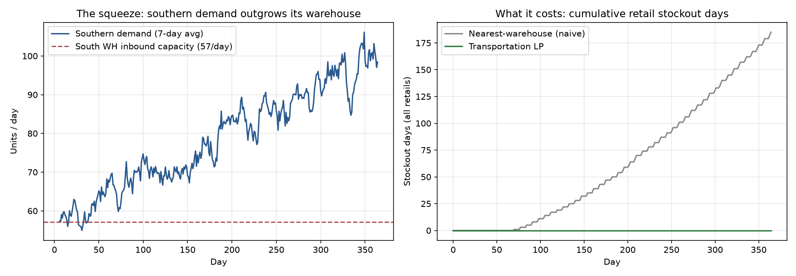

# Supply Chain Digital Twin

**[→ Live results dashboard](https://taim-ss.github.io/digital-twin-supply-chain/)** — explore the tradeoff across lead times and service levels interactively.

A warehouse inventory policy tuned from historical averages, replaced by one driven by a live demand forecast. Run head to head on identical seasonal, trending demand for a full simulated year (10 paired replications):

| | Static (historically-tuned) | Forecast-driven |
|---|---|---|
| Stockout days / year | 7.6 | **1.5** (−80%) |
| Service level | 97.9% | **99.6%** |
| Total cost / year | 35,233 | 40,973 (+16.3%) |


Not "AI wins on every metric" — a real tradeoff, and the reason for it is the finding: the static policy is sized once from 180 days of history and never updates, so as real demand grows past that stale average, it quietly under-stocks. The forecast-driven policy re-forecasts every 7 days and holds more inventory to match *actual current* demand — trading ~16% more holding cost for 80% fewer stockouts. At longer lead times the gap widens dramatically (23 vs 1.5 stockout days at a 7-day lead time). Whether the trade is worth it depends on your real stockout cost, which this simulation deliberately keeps out of scope — explore how it shifts across lead times and service targets on the [live dashboard](https://taim-ss.github.io/digital-twin-supply-chain/).

## Phase 3 — the routing optimizer

The twin grows into a network: two regional warehouses serving four retail stores, where southern demand outgrows the South warehouse's fixed inbound capacity over the year. Two allocation strategies run on identical demand, identical replenishment, identical information — the only difference is how warehouse stock gets distributed:

| | Nearest-warehouse (naive) | Transportation LP |
|---|---|---|
| Fill rate | 82.8% | **100.0%** |
| Stockout days / year | 197.3 | **0.0** |
| Transport cost / year | 18,661 | 35,307 (+89%) |
| Total cost / year | 330,741 | 359,394 (+8.7%) |

*(10 paired replications, 365-day horizon — LP hits zero stockouts on every seed.)*



The network holds enough total inventory either way — replenishment pre-positions overflow stock at the North warehouse because the South's inbound lanes are full. The naive rule strands that stock where it landed: every retail is served only by its home warehouse, so the South starves while the North sits on surplus (197 stockout days, all southern). The optimizer — a min-cost transportation LP (scipy HiGHS) over every warehouse–retail lane with a shortage penalty — re-routes ~8,000 units/year across regions and eliminates stockouts entirely, paying ~89% more transport for it. Its plan isn't advisory: each shipment it proposes mutates the twin's state, and next week's forecasts, replenishment, and allocation react to the world it created. That's the loop — forecast → optimize → simulate → repeat — that makes it a digital twin rather than a report.

## The forecaster behind it

Four models, backtested with 6-fold walk-forward validation:

| model | MAE | RMSE | MAPE |
|---|---|---|---|
| naive | 10.59 | 13.66 | 25.1% |
| seasonal_naive | 8.83 | 11.37 | 19.8% |
| **holt_winters** | **6.35** | **8.53** | **13.7%** |
| gradient_boosting | 8.55 | 11.43 | 18.8% |

Holt-Winters wins because the demand process has the exact trend + weekly seasonality shape it's built to model directly — gradient boosting still clearly beats the naive baseline, just not the classical method built for this pattern.


## Try it yourself

An interactive control panel runs the real engine live — pick lead time, target service level, and forecaster, and watch both policies run:

```bash
pip install -r requirements.txt
streamlit run streamlit_app.py
```

## Architecture

```
scenarios/baseline.json  # The twin, defined declaratively (DTDL-style): demand, network, costs
scenarios/network.json   # Phase 3 twin: warehouses, retails, lanes, capacities
supply_chain_twin/
├── entities.py       # Node, Inventory, Shipment
├── demand.py          # DemandProcess: stationary (Phase 1) / seasonal+trend (Phase 2)
├── forecasting.py     # 4 forecasters + walk-forward backtest
├── policies.py        # ReorderPolicy: static (s,S) and forecast-driven
├── engine.py           # SimulationEngine, KPIs, replication runner
├── routing.py          # Allocator: nearest-warehouse and transportation LP
├── network.py          # NetworkSimulationEngine: the multi-echelon twin
├── scenario.py         # Loads scenario documents into runnable twins
├── run.py              # Phase 1 entry point
├── run_phase2.py       # Phase 2 entry point: backtest -> policy -> comparison
└── run_phase3.py       # Phase 3 entry point: naive vs LP allocation on the network
streamlit_app.py         # Live interactive control panel
docs/index.html          # The live dashboard (static, GitHub Pages)
tests/                   # 53 tests, all passing
```

`ReorderPolicy`, `DemandProcess`, and `Allocator` are all small protocols — the forecast-driven policy, the seasonal demand model, and the transportation LP plug into their engines without the engine knowing or caring which kind it's running. That's what let Phase 2 add a full forecasting pipeline, and Phase 3 a routing optimizer, without breaking any earlier phase's tests. The twin itself is described by a scenario document (`scenarios/baseline.json`, `scenarios/network.json`) rather than hardcoded parameters — the dashboard exporter and any future consumer run the same twin by loading the same file.

Modeling assumptions: lost sales (unmet demand is lost, not backordered), and the lead-time convention that an order placed on day *t* with lead time *L* arrives at the start of day *t + L*. Phases 1–2 model a single echelon (one warehouse, one unconstrained supplier); Phase 3's network twin adds capacity-constrained warehouse inbound and per-lane transport costs and lead times.

## Roadmap

- ~~**Phase 1** — simulation core.~~ Done.
- ~~**Phase 2** — forecasting model driving the reorder policy.~~ Done.
- ~~**Phase 4** — interactive control panel (shipped early: the live dashboard plus the Streamlit app).~~ Done.
- ~~**Phase 3** — a routing optimizer whose plan feeds back into the twin's state, closing the loop between forecast, simulation, and network decisions.~~ Done.
